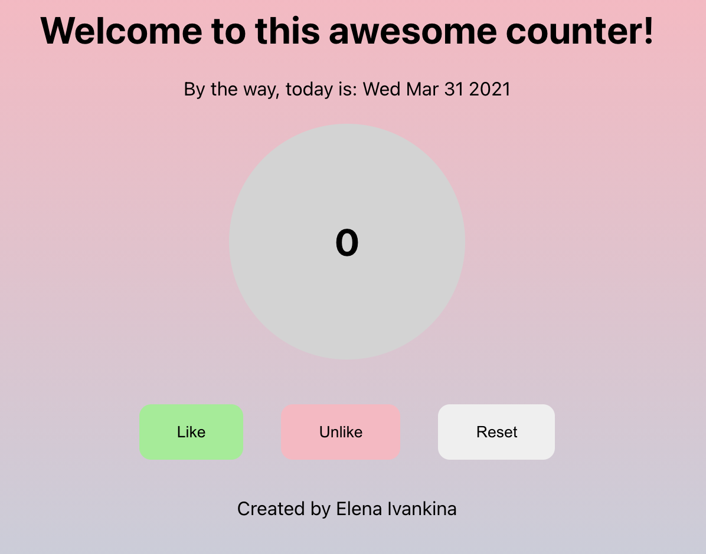

# React/Redux course exercises for Business College Helsinki

## task1_boxes

Just starting to study React. Trying how to use components and how to do css styling in React.

## task2_counter

Here I have studied better both function and class components. Studied also some conditional styling.

This counter will add 1 if you press Like button, remove 1 if you press Unlike button ans will get reset if you press Reset button.

Also the background color of the counter is changing basen on whether the number is odd or even.

