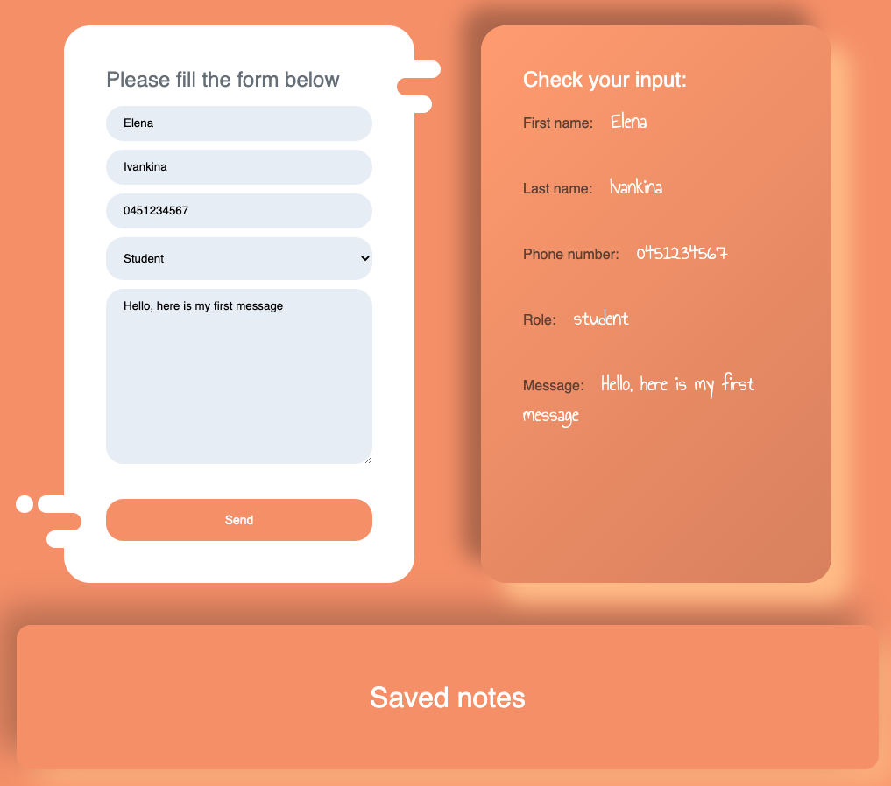

# React/Redux course exercises for Business College Helsinki

## task1_boxes

Just starting to study React. Trying how to use components and how to do css styling in React.

## task2_counter

Here I have studied better both function and class components. Studied also some conditional styling.

This counter will add 1 if you press Like button, remove 1 if you press Unlike button ans will get reset if you press Reset button.

Also the background color of the counter is changing basen on whether the number is odd or even.

## task3_speed_game

A speed game made with React framework. Can be played here:[https://ivankina.fi/speed_game/](https://ivankina.fi/speed_game/)

## task4_forms

Practicing to make forms with React

## task5_axios_hooks

Studying hooks and axios in React

## task6_todo_list

Made my to-do list with React, but without Redux yet

## task7_counter_redux

Simple counter application using Redux

## task8_todo_list_redux

To-do list made using Redux

## task9_todo_redux_hooks_thunk

Same to-do list, but using Redux with hooks and thunk

## task10_sass

Studying Sass

## udemy1_components

Adding here some exercises I do following Udemy React course
